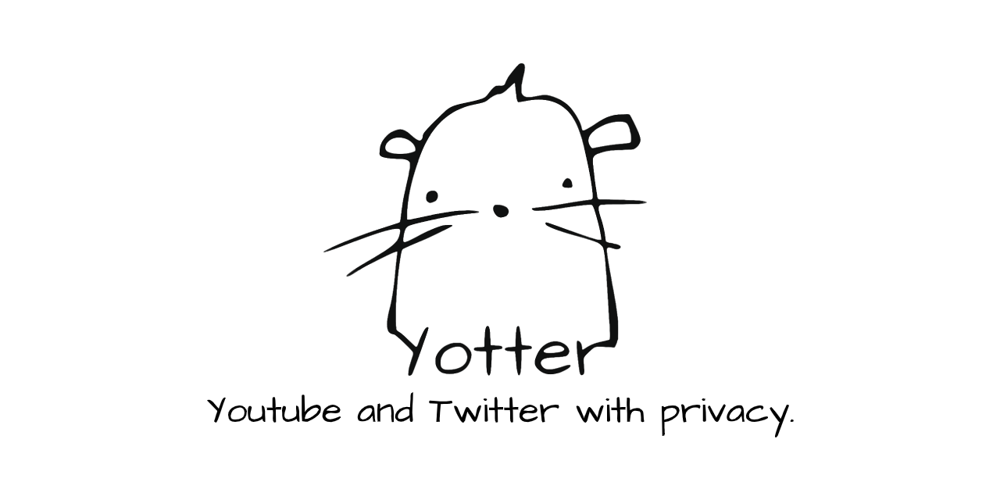

  </img>
 

   <a href="https://www.gnu.org/licenses/gpl-3.0"></img></a>
   <a href="https://github.com/pluja/Yotter"></img></a>
   <a href="https://github.com/pluja/Yotter/pulls"></img></a>

 

Yotter allows you to follow and gather all the content from your favorite Twitter and YouTube accounts in a *beautiful* feed so you can stay up to date without compromising your privacy at all. Yotter is written with Python and Flask and uses Semantic-UI as its CSS framework.

Yotter is possible thanks to several open-source projects that are listed on the [Powered by](#powered-by) section. Make sure to check out those awesome projects!

# Index:
* [Why](#why)
* [Features](#features)
* [FAQ](#FAQ)
* [Privacy and Security](#privacy)
* [Public instances](#public-instances)
* [Self hosting](https://github.com/ytorg/Yotter/blob/dev-indep/SELF-HOSTING.md)
    * [Update the server](https://github.com/ytorg/Yotter/blob/dev-indep/SELF-HOSTING.md#updating-the-server)
* [Contributing and contact](#contributing)
* [Powered by](#powered-by)
* [Donate](#donate)
* [Screenshots](#screenshots)

# Why
Youtube and Twitter are well-known by their invasive and data-stealing *'privacy policies'*. You give them a **lot** of data; from ideology to music taste, your likes and dislikes, your free-time schedule, and much more than you think. This much data gives such companies a control over you that you would never thought.

With the *particular* data about you, they can get money from the highest bidder and target advertisements. This could seem *not-as-bad* but it gets worse. They can sell this data to some company that, with such knowledge about you, could harm your future in a way you can't imagine. What if you are watching self-help videos on Youtube and this data ends on you insurance hands? Would they raise your fee because they consider you are not *emotionally stable*? We can think of thousands of examples like this, where the data ends in the wrong hands and harms you in an unexpected way.

Further more, they don't care about **what you in particular watch**, this is only sold to the highest bidder who then may or may not do the harm. What they care more about is **what people watch** this is the important data and the one that allows to manipulate, bias, censor, etc.

So we need platforms and spaces where we can freely watch and listen content without these watchful eyes upon us. Ideally, everyone would use a free (as in freedom) and decentralized platform like [Peertube](https://joinpeertube.org/), [LBRY](https://lbry.tv/), [Mastodon](https://joinmastodon.org/) or [Pleroma](https://pleroma.social/) but things are not like this. The main multimedia content factory is Youtube and the microblogging king is Twitter. So we will do whatever is possible to be able to watch and read the content and avoid the surveillance that seeks us these days. We will resist.

# Features:
- [x] No Ads.
- [x] No Javascript needed*
- [x] Minimalist.
- [x] Search on Twitter and Youtube.
- [x] Zero connections to Google/Twitter on the client.
- [x] Follow Twitter accounts.
- [x] Follow Youtube accounts.
- [x] Play Youtube videos on background on Android.
- [x] Play only audio from youtube to save data.
- [x] Save your favourite Tweets.
- [x] Tor-friendly.
- [x] Terminal-browser friendly.

*Video player is VideoJS, which uses JavaScript. But if JavaScript is disabled Yotter still works perfectly and uses the default HTML video player.
> And many more to come!

# FAQ
### What's the difference between this and Invidious?
At first I started working on this project as a solution for following Twitter accounts (a thing that can't be done with Nitter) and getting a Twitter-like feed. Weeks later the leader of Invidious, Omar Roth, announced that he was stepping away from the project. As an Invidious active user, this made me think that a new alternative was needed for the community and also an alternative with an easier programmin language for most people (as Invidious is written in Crystal). So I started developing a '*written-in-python Invidious alternative*' and it went quite well.

I hope that this project can prosperate, gain contributors, new instances and create a good community around it.

### Why do I have to register to use Yotter?

Registering has two main reasons:

1. Yotter is in a **beta** state. This means that we will be incrementally increasing the capacity of the servers so we can empirically know how many users a Yotter server can handle. Also, there is no **big server** with capacity for handling any arbitrary ammount of users and serving video/data to those at the moment. For this, we decided to have a registration form so we could limit the users.

2. Yotter allows users to follow accounts and have a custom feed. This needs an account to save your followed users and generate a feed.

Admins are allowed to remove restrictions on any page they want. [Check this section](https://github.com/ytorg/Yotter/blob/dev-indep/SELF-HOSTING.md#removing-log-in-restrictions) to learn how.

# Privacy
#### Connections
Yotter cares about your privacy, and for this it will never make any connection to Twitter or Youtube on the client. Every request is proxied through the Yotter server; video streaming, photos, data gathering, scrapping, etc.

The Yotter server connects to Google (Youtube) and Nitter in order to gather all the necessary data. Then it serves it (proxyed through itself) to the client. This means that as a client, you will never connect to Google/Youtube/Twitter - the Yotter server will do it for you. So if you want to set up a Yotter server for privacy reasons I recommend you to set it up on a remote VPS so you don't share your IP with, or use a VPN on the server. 

If you don't mind exposing your IP making requests to Google then you can set it up wherever you want. Even with this method you will **avoid all trackers, ads, heavy-loaded pages, etc**. - you can still stay safe if you use a VPN to hide your IP.

#### Your data
The only things the database stores are:
* Salted hash of the password
* Username
* List of followed users
* List of saved posts
* Some user configurations

This data will never be used for any other purpose than offering the service to the user. It's not sent anywhere, never.

#### Security
Only the salted hash of your password is stored in the database, so no admin can see or guess your plain-text password ever. Also, no personal information of any kind is required nor kept, if a hacker gets access to the database the only thing they could do would be to follow/unfollow some accounts. So there's no motivation in 'hacking' Yotter.

I always recommend self-hosting, as you will be the only person with access to your data.

> Important note: The **client** never connects to Google / Youtube however, the server does in order to gather all the necessary things!

# Public Instances
| name |server location|Capacity|registrations|
| ------------ | ------------ | ------------ |------------|
| https://yotter.xyz/  |Germany| [Check](https://yotter.xyz/registrations_status/text)||
| https://yotter.kavin.rocks/  |India| [Check](https://yotter.kavin.rocks/registrations_status/text) ||
| https://yotter.jank.media/  |Germany| [Check](https://yotter.jank.media/registrations_status/text)||

# Contributing
Contributors are always welcome. You can help in many ways: Coding, organizing, designing, [donating](#donate), maintaining... You choose what you want to help with!

We have a [Matrix](https://matrix.org/) room where we discuss anything related with Yotter, feel free to enter the room and start talking or reading. You can choose a Matrix client from [this list of Matrix clients](https://matrix.org/clients/). Also you will need to choose an instance to host your account, you can find Matrix instances [here](https://www.hello-matrix.net/public_servers.php).

<a href="https://matrix.to/#/!wqJnbUtEfitxtOsLFj:privacytools.io?via=privacytools.io&via=matrix.org">
   
 #### Other platforms:
 <a href="https://reddit.com/r/Yotter">

# Powered by:
These are projects that either make Yotter possible as an **essential part** of it or that served as **inspiration for some parts** of the code.

* [Nitter](https://nitter.net/)
* [Youtube-local](https://github.com/user234683/youtube-local)
* [youtube-dl](https://github.com/ytdl-org/youtube-dl)
* [Flask](https://flask.palletsprojects.com/)
* [SQLAlchemy](https://docs.sqlalchemy.org/en/13/)
* [Semantic-UI](https://semantic-ui.com)
* [requests-futures](https://github.com/ross/requests-futures)
* [microblog](https://github.com/miguelgrinberg/microblog)
* [Video.js](https://videojs.com/)
* [My fork of youtube_search](https://github.com/pluja/youtube_search-fork)
* [Invidious](https://github.com/iv-org/invidious)

# Donate
This project is completely free and Open Source and will always be.

All donations are used to mantain the [yotter.xyz](https://yotter.xyz/) public instance. [This is the server](https://www.netcup.eu/bestellen/produkt.php?produkt=2598) that I have rented for now.

#### Crypto (preferred):
- **Bitcoin**: `bc1q5y3g907ju0pt40me7dr9fy5uhfhfgfv9k3kh3z`
- **Monero**: `48nQGAXaC6eFK2Wo7SVVyF9xL333gDHjzdmRL3XETEqbU3w4CcKjjHVUZPU4W3dg1oJL8be3iGtUAQsgV88dzbS7QNpZjC2`
#### Fiat:
- 

## Screenshots

  </img>
 

  </img>
 

  </img>
 

  </img>
 

  </img>
 

  </img>
 
